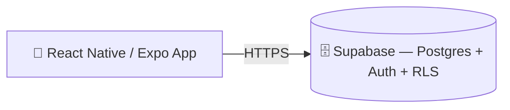
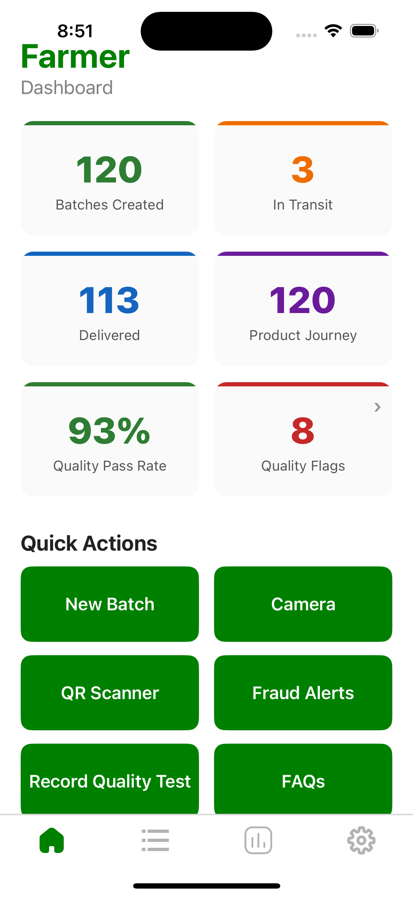
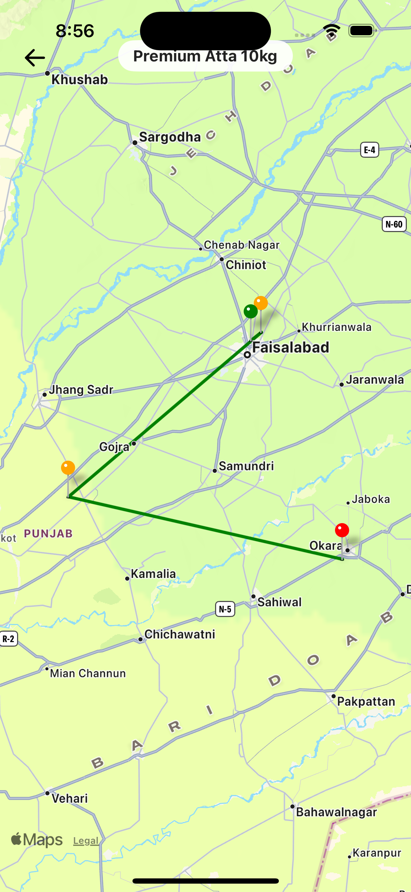
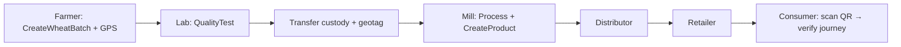

<div align="center">

# 🌾 AgroChain

**A Wheat and Sugar Traceability Solution using IoT and Blockchain**

Farm‑to‑consumer traceability for Pakistan's wheat & sugarcane supply chains.

[]()
[-3ecf8e)]()
[]()
[]()

</div>

---

## 📋 Project Overview

AgroChain records every stage of the wheat and sugarcane supply chains — from a farmer's
harvest, through collection/procurement centers, transporters, warehouses, mills,
distributors, and retailers — in a secure, role-based **Supabase (Postgres)** backend.
Consumers scan a QR code on a bag of flour or sugar to view the product's complete
journey, lab quality results, and farm of origin on a map.

## 🎯 Objectives

1. Record every custody and processing event with a reliable, non-editable audit trail.
2. Enforce role‑based authorization via Supabase Auth and Postgres row-level security.
3. Provide a mobile app for participants (capture) and consumers (verification).
4. Geotag harvests and transfers for spatial traceability.
5. Surface quality‑assurance and fraud‑detection signals to regulators.
6. Operate offline in rural areas and in Urdu + English.

## ✨ Features

- 🔗 Farm‑to‑shelf traceability with a full custody-history audit trail
- 📱 Consumer QR verification (journey, quality, GPS route map)
- 🧪 Lab quality reports (moisture, protein, gluten, contamination)
- 🚨 Fraud/anomaly detection (weight variance, extraction ratio, duplicate QR, quality failure)
- 📊 Live KPI dashboard
- 📡 Offline‑first capture with auto‑sync
- 🌐 Bilingual UI (English + اردو) with RTL
- 📍 GPS geotagging of harvests and transfers

## 🏗️ Architecture



Two tiers: **mobile client** → **Supabase** (Postgres database, Auth, and row-level
security policies — no custom backend server to deploy or maintain).

> **Note:** `docs/System_Architecture.md` and other files under `docs/` describe the
> original Hyperledger Fabric design and have not yet been updated for the Supabase
> backend — treat them as historical background, not current architecture.

## 🧰 Technologies Used

| Layer | Tech |
|-------|------|
| Mobile | React Native 0.73, Expo SDK 50, React Navigation |
| Backend | Supabase (Postgres, Auth, Row-Level Security) via `@supabase/supabase-js` |
| Mobile libs | expo-camera, expo-location, react-native-maps, AsyncStorage, NetInfo |

## 🗄️ Supabase Backend

- **Tables:** `profiles`, `wheat_batches`, `batch_transfers`, `quality_reports`,
  `consumer_issues` — see [`supabase/schema.sql`](supabase/schema.sql).
- **Auth:** sign-in/sign-up by mobile number (11 digits, starting with 0) — no email or
  free-form username. Internally mapped to a synthetic `<number>@agrochain.local` address
  for Supabase Auth.
- **Authorization:** Postgres row-level security (RLS) — public read on all tables,
  authenticated write. `wheat_batches` also allows authenticated updates (status
  progression); `batch_transfers`, `quality_reports`, and `consumer_issues` are
  insert-only once created (see `PRIVACY.md` §4 for what this means for users).
- **Legacy:** the `go/`, `org/`, and `configtx/` directories are leftover Hyperledger
  Fabric chaincode/network config from before the Supabase migration and are not used by
  the shipped app.

## 📱 Mobile App Overview (Android & iOS)

A **single React Native / Expo codebase** runs on **Android**, **iOS**, and the **web**.
Global providers for **i18n**, **Auth** (Supabase-backed sign-in by mobile number +
persisted session), and **offline‑first Sync** wrap a session‑gated navigator. Screens include the KPI dashboard,
batch registration (GPS), QR scanner, consumer product journey with map route, lab quality
dashboard, fraud alerts, and settings (language, about, logout).
Details: [`docs/Mobile_Application_Documentation.md`](docs/Mobile_Application_Documentation.md).

| Platform | Min target | Distribution | Key native modules |
|----------|-----------|--------------|--------------------|
| Android | Android 6.0+ (API 23) | Google Play (AAB) | expo-camera, expo-location, react-native-maps |
| iOS | iOS 13.4+ | Apple App Store (IPA) | expo-camera, expo-location, react-native-maps (Apple Maps) |
| Web | modern browsers | static hosting | react-native-web |

**iOS specifics**
- Bundle identifier: `com.agrochain.app` (`app.json` → `ios.bundleIdentifier`).
- Permissions declared in `app.json` → `ios.infoPlist`: `NSCameraUsageDescription` (QR
  scanning) and `NSLocationWhenInUseUsageDescription` (geotagging).
- Maps use **Apple Maps** on iOS via `react-native-maps` (no extra key required).
- Building/running iOS requires **macOS + Xcode**; see Installation/Deployment below.

## ⚙️ Installation

```bash
git clone <repo-url> agrochain && cd agrochain
npm install
npx expo install   # align native deps with Expo SDK 50
# set app.json → expo.extra.supabaseUrl / expo.extra.supabaseAnonKey
npx expo start     # then press: a = Android · i = iOS Simulator · w = web
```

**Run on iOS (macOS only):**
```bash
# Option 1 — Expo Go on a physical iPhone: scan the QR from `npx expo start`
# Option 2 — iOS Simulator (requires Xcode + an installed iOS runtime):
npx expo start      # press "i"
# Option 3 — full native build with CocoaPods:
npx expo run:ios
```
> iOS development requires **macOS with Xcode**, an iOS Simulator runtime, and CocoaPods.
> Recommended Node 18/20 for Expo SDK 50.

Full guide: [`docs/Installation_Guide.md`](docs/Installation_Guide.md).

## 🚀 Deployment

The backend is Supabase — there is no gateway server to deploy. Run `supabase/schema.sql`
(and optionally `supabase/seed.sql`) once in the Supabase SQL Editor for a new project,
then ship the mobile app:

```bash
npx expo prebuild --platform android --clean && cd android && ./gradlew bundleRelease   # AAB → Google Play
npx expo prebuild --platform ios --clean   # then open ios/AgroChain.xcworkspace in Xcode,
                                            # Product → Archive → Distribute App → App Store Connect
```
> iOS release builds require a **macOS machine with Xcode** and an **Apple Developer account**
> ($99/yr) signed into Xcode (Settings → Accounts) with automatic signing enabled. Android
> release builds require a release keystore configured in `android/app/build.gradle`.

Full guide: [`docs/Deployment_Guide.md`](docs/Deployment_Guide.md) · Store steps: `STORE.md`.

## ⚙️ Configuration

| Setting | Where | Example |
|---------|-------|---------|
| Supabase project URL | `app.json` → `expo.extra.supabaseUrl` | `https://xxxx.supabase.co` |
| Supabase anon/publishable key | `app.json` → `expo.extra.supabaseAnonKey` | `sb_publishable_...` |
| Default wallet user (read-only fallback) | `app.json` → `expo.extra.defaultUsername` | `appUser` |
| Demo mode override | `app.json` → `expo.extra.demoMode` | omit to auto-detect |

The Supabase anon/publishable key is safe to ship in the client — it's restricted by
row-level security, not a secret. **Never commit** a Supabase **service-role** key,
`.env` files, or signing certificates — they are git‑ignored.

## 📸 Screenshots

English UI (captured from the running app):

| Dashboard | Add Crop | Supply Chain Tracking |
|-----------|----------|------------------------|
|  |  |  |

| Settings (EN/اردو) | About (acknowledgment) | Fraud Alerts |
|--------------------|------------------------|--------------|
|  |  |  |

| Product Journey (consumer) | GPS Map Route |
|----------------------------|---------------|
|  |  |

> Screens above are rendered with the bundled **Pakistan‑specific demo dataset**
> (`Services/demoData.js`, Oct 2024 – May 2026). The **GPS Map Route** shows the geotagged
> custody trail (farm → collection → mill → retailer) with real Punjab coordinates; on a
> physical device it renders on the native map (Google/Apple Maps).
> Regenerate with `node scripts/capture-screenshots.js`.

### اردو (Urdu) UI

| Dashboard (ڈیش بورڈ) | Product Journey | GPS Map Route |
|----------------------|-----------------|---------------|
|  |  |  |

> Full Urdu localization with right‑to‑left (RTL) layout. Regenerate with
> `node scripts/capture-ur.js`. (Remaining: **QR Scanner** needs a camera/device.)

### iOS (native, captured on the iOS Simulator)

| Dashboard | GPS Route on Apple Maps |
|-----------|--------------------------|
|  |  |

> Captured running natively in **Expo Go** on the iOS Simulator (`npx expo start --ios`).
> The GPS map renders on **real Apple Maps** — the geotagged custody trail
> (Faisalabad → Toba Tek Singh → Okara) plotted across Punjab, Pakistan.

## 🔄 Traceability Workflow



## 🙏 Funding Acknowledgment

> The authors gratefully acknowledge the financial support provided by the **Higher Education
> Commission (HEC), Pakistan**, under the **National Research Program for Universities (NRPU)**.

## 🎓 Research Project Information

| | |
|---|---|
| **Project** | AgroChain – A Wheat and Sugar Traceability Solution using IoT and Blockchain |
| **NRPU Project No.** | 15516 |
| **Funding Agency** | Higher Education Commission (HEC), Pakistan |
| **Host Institution** | Department of Computer Science / Precision Agriculture Lab, Center for Advanced Studies in Agriculture and Food Security, University of Agriculture Faisalabad, Pakistan |
| **Team / PI** | *To Be Completed by Project Team* |

## 📁 Project Structure

```
AgroChain/
├── App.js                 # Root: I18n → Auth → Sync → Navigation
├── Navigation/            # Stack + bottom-tab navigators (session-gated)
├── Screens/               # UI screens (Home, ProductJourney, LabDashboard, …)
├── Abstracts/             # Shared UI (Button, Input, Container, Theme, SyncStatusBar)
├── Services/              # api, SyncContext/SyncQueue, AuthContext, location, fraudDetection, config
├── i18n/                  # English + Urdu translations
├── Svgs/ · Images/ · assets/   # Icons and images
├── supabase/              # schema.sql + seed.sql for the Postgres backend
├── go/                    # LEGACY: pre-migration Hyperledger Fabric chaincode (unused)
├── org/                   # LEGACY: pre-migration Node/Express gateway + CA (unused)
├── configtx/              # LEGACY: pre-migration Fabric channel/org config (unused)
├── docs/                  # Documentation (architecture docs predate the Supabase migration)
├── app.json               # Expo app config
└── package.json
```

## 🤝 Contributing

Contributions are welcome — see [`CONTRIBUTING.md`](CONTRIBUTING.md) and our
[`CODE_OF_CONDUCT.md`](CODE_OF_CONDUCT.md). For vulnerabilities, follow [`SECURITY.md`](SECURITY.md).

## 📚 Documentation

Full suite in [`docs/`](docs/): Project Overview, System & Fabric Architecture, Transaction
Flow, Chaincode, Android App, API, Database, Deployment, Installation, User & Administrator
Manuals, Security Overview, Troubleshooting, Code Review, and research reports in
[`docs/reports/`](docs/reports/). **Most of `docs/` predates the Supabase migration and
still describes the Hyperledger Fabric design** — treat it as historical background, not
a current reference, until it's updated. Changelog: [`CHANGELOG.md`](CHANGELOG.md).

## 📄 License

This project is licensed under the MIT License. See the LICENSE file for details.

---

<div align="center">
Developed under HEC NRPU Project No. 15516 · University of Agriculture Faisalabad
</div>
