<div align="center">

# 🌾 AgroChain

**A Wheat and Sugar Traceability Solution using IoT and Blockchain**

Farm‑to‑consumer traceability for Pakistan's wheat & sugarcane supply chains.

[]()
[]()
[]()
[]()

</div>

---

## 📋 Project Overview

AgroChain records every stage of the wheat and sugarcane supply chains — from a farmer's
harvest, through collection/procurement centers, transporters, warehouses, mills,
distributors, and retailers — on a permissioned **Hyperledger Fabric** blockchain. Consumers
scan a QR code on a bag of flour or sugar to view the product's complete, tamper‑evident
journey, lab quality results, and farm of origin on a map.

## 🎯 Objectives

1. Record every custody and processing event on an immutable ledger.
2. Enforce role‑based authorization at the smart‑contract level.
3. Provide a mobile app for participants (capture) and consumers (verification).
4. Geotag harvests and transfers for spatial traceability.
5. Surface quality‑assurance and fraud‑detection signals to regulators.
6. Operate offline in rural areas and in Urdu + English.

## ✨ Features

- 🔗 Farm‑to‑shelf traceability with on‑chain custody history
- 📱 Consumer QR verification (journey, quality, GPS route map)
- 🧪 Lab quality reports (moisture, protein, gluten, contamination)
- 🚨 Fraud/anomaly detection (weight variance, extraction ratio, duplicate QR, quality failure)
- 📊 Live KPI dashboard
- 📡 Offline‑first capture with auto‑sync
- 🌐 Bilingual UI (English + اردو) with RTL
- 📍 GPS geotagging of harvests and transfers

## 🏗️ Architecture

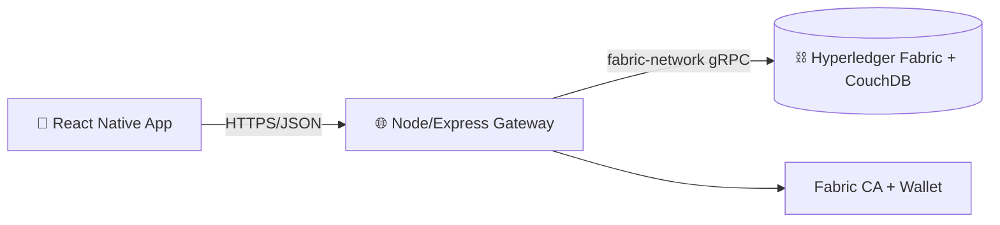

Three tiers: **mobile client** → **REST gateway** → **Fabric network (CouchDB world state)**.
Details: [`docs/System_Architecture.md`](docs/System_Architecture.md).

## 🧰 Technologies Used

| Layer | Tech |
|-------|------|
| Mobile | React Native 0.73, Expo SDK 50, React Navigation |
| Gateway | Node.js, Express, `fabric-network`, `fabric-ca-client` |
| Smart contract | Go, `fabric-contract-api-go` |
| Ledger/State | Hyperledger Fabric v2, CouchDB |
| Mobile libs | expo-camera, expo-location, react-native-maps, AsyncStorage, NetInfo |

## ⛓️ Hyperledger Fabric Components

- **Orgs (5 + orderer):** FarmerOrg1, PunjabOrg3, MillOrg4, DealerOrg5, RetailerOrg6 + OrdererOrg
- **Channel:** `supplychain-channel` · **Chaincode:** `supplychain` (Go, 23 transactions)
- **MSP/CA:** X.509 identities, file‑system wallet, role‑based chaincode authorization
- **State DB:** CouchDB with 4 rich‑query indexes
- **Ordering:** Raft

See [`docs/Hyperledger_Fabric_Architecture.md`](docs/Hyperledger_Fabric_Architecture.md) and
[`docs/Chaincode_Documentation.md`](docs/Chaincode_Documentation.md).

## 📱 Mobile App Overview (Android & iOS)

A **single React Native / Expo codebase** runs on **Android**, **iOS**, and the **web**.
Global providers for **i18n**, **Auth** (CA‑backed login + persisted session), and
**offline‑first Sync** wrap a session‑gated navigator. Screens include the KPI dashboard,
batch registration (GPS), QR scanner, consumer product journey with map route, lab quality
dashboard, fraud alerts, and settings (language, about, logout).
Details: [`docs/Mobile_Application_Documentation.md`](docs/Mobile_Application_Documentation.md).

| Platform | Min target | Distribution | Key native modules |
|----------|-----------|--------------|--------------------|
| Android | Android 6.0+ (API 23) | Google Play (AAB) | expo-camera, expo-location, react-native-maps |
| iOS | iOS 13.4+ | Apple App Store (IPA) | expo-camera, expo-location, react-native-maps (Apple Maps) |
| Web | modern browsers | static hosting | react-native-web |

**iOS specifics**
- Bundle identifier: `com.agrochain.app` (`app.json` → `ios.bundleIdentifier`).
- Permissions declared in `app.json` → `ios.infoPlist`: `NSCameraUsageDescription` (QR
  scanning) and `NSLocationWhenInUseUsageDescription` (geotagging).
- Maps use **Apple Maps** on iOS via `react-native-maps` (no extra key required).
- Building/running iOS requires **macOS + Xcode**; see Installation/Deployment below.

## ⚙️ Installation

```bash
git clone <repo-url> agrochain && cd agrochain
npm install
npx expo install   # align native deps with Expo SDK 50
# set app.json → expo.extra.apiBaseUrl
npx expo start     # then press: a = Android · i = iOS Simulator · w = web
```

**Run on iOS (macOS only):**
```bash
# Option 1 — Expo Go on a physical iPhone: scan the QR from `npx expo start`
# Option 2 — iOS Simulator (requires Xcode + an installed iOS runtime):
npx expo start      # press "i"
# Option 3 — full native build with CocoaPods:
npx expo run:ios
```
> iOS development requires **macOS with Xcode**, an iOS Simulator runtime, and CocoaPods.
> Recommended Node 18/20 for Expo SDK 50.

Full guide: [`docs/Installation_Guide.md`](docs/Installation_Guide.md).

## 🚀 Deployment

```bash
# Gateway
cd org && npm install && node enrollAdminOrg1.js && node serverOrg1.js

# Mobile releases (EAS)
eas build --platform android --profile production   # AAB → Google Play
eas build --platform ios --profile production       # IPA → Apple App Store
eas submit --platform ios --profile production       # upload to App Store Connect
```
> iOS release builds require an **Apple Developer account** ($99/yr). EAS can manage signing
> credentials, or run on macOS with Xcode. Android → Google Play; iOS → App Store Connect.

Full guide: [`docs/Deployment_Guide.md`](docs/Deployment_Guide.md) · Store steps: `STORE.md`.

## ⚙️ Configuration

| Setting | Where | Example |
|---------|-------|---------|
| Mobile backend URL | `app.json` → `expo.extra.apiBaseUrl` | `https://api.your-domain` |
| Default wallet user | `app.json` → `expo.extra.defaultUsername` | `appUser` |
| Gateway port/host | `org/.env` (`PORT`, `HOST`) | `8081` / `0.0.0.0` |
| CA / MSP / channel / chaincode | `org/.env` | see `org/.env.example` |
| CA admin bootstrap creds | `org/.env` (`CA_ADMIN_ID`, `CA_ADMIN_SECRET`) | — |
| Fabric connection profile | `org/connection-org1.json` (git‑ignored) | see `org/connection-org1.example.json` |

Copy the examples and fill in real values:
```bash
cp .env.example .env                 # optional (root build vars)
cp org/.env.example org/.env         # gateway config + CA admin secret
cp org/connection-org1.example.json org/connection-org1.json   # then paste real certs
```
**Never commit** `.env`, `org/connection-org1.json`, wallets, or keys — they are git‑ignored.

## 📸 Screenshots

English UI (captured from the running app):

| Dashboard | Add Crop | Supply Chain Tracking |
|-----------|----------|------------------------|
| 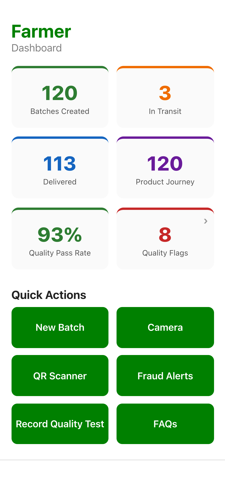 | 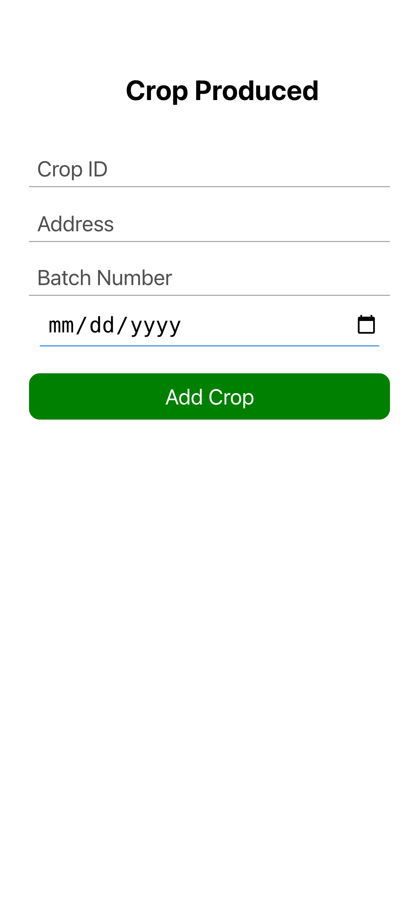 | 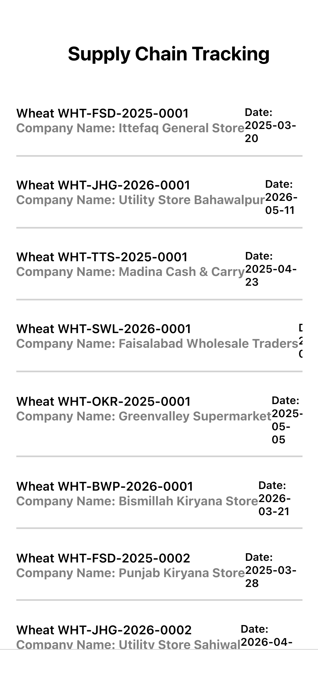 |

| Settings (EN/اردو) | About (acknowledgment) | Fraud Alerts |
|--------------------|------------------------|--------------|
| 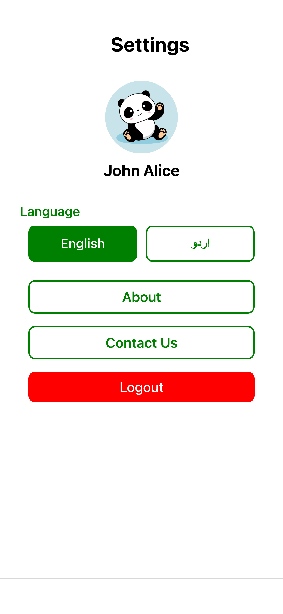 | 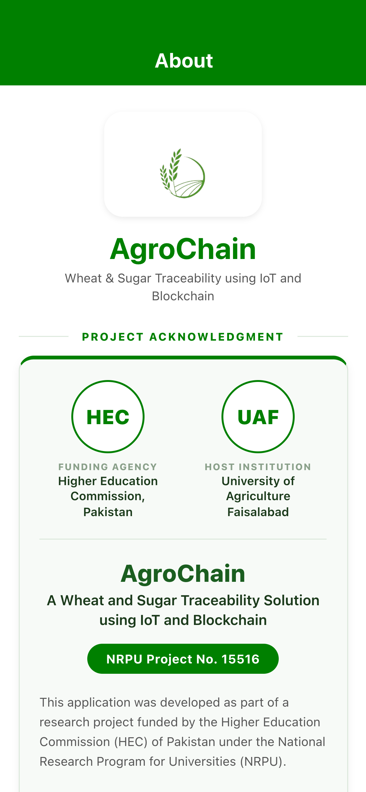 | 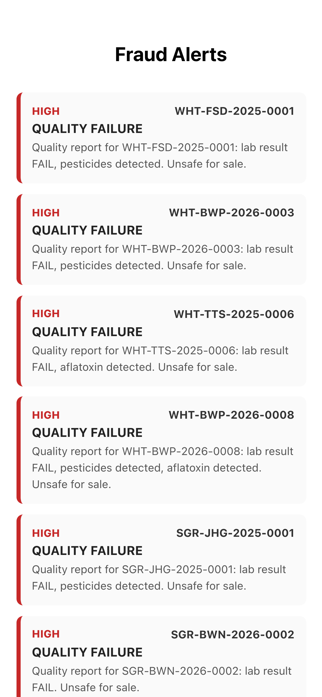 |

| Product Journey (consumer) | GPS Map Route |
|----------------------------|---------------|
| 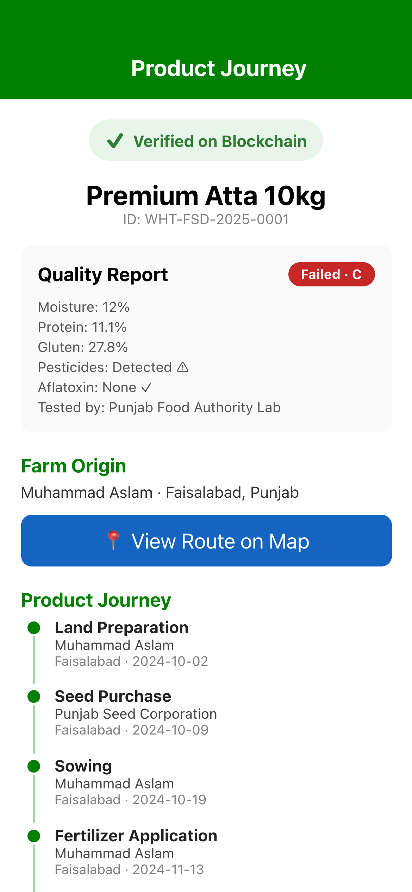 | 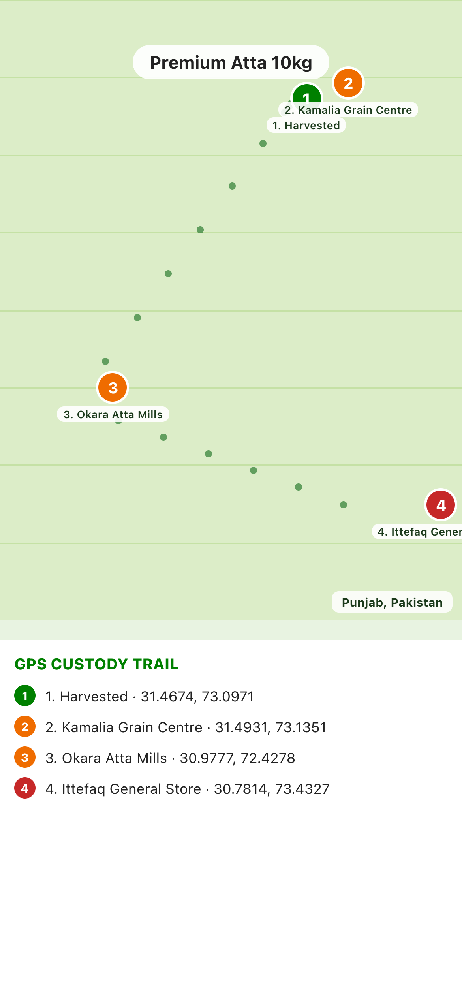 |

> Screens above are rendered with the bundled **Pakistan‑specific demo dataset**
> (`Services/demoData.js`, Oct 2024 – May 2026). The **GPS Map Route** shows the geotagged
> custody trail (farm → collection → mill → retailer) with real Punjab coordinates; on a
> physical device it renders on the native map (Google/Apple Maps).
> Regenerate with `node scripts/capture-screenshots.js`.

### اردو (Urdu) UI

| Dashboard (ڈیش بورڈ) | Product Journey | GPS Map Route |
|----------------------|-----------------|---------------|
| 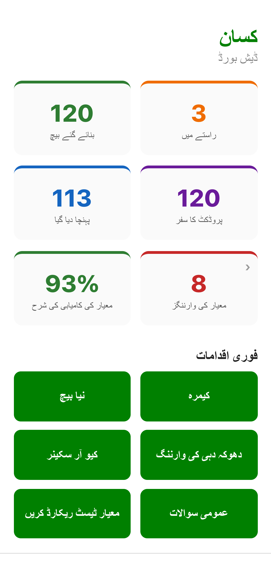 | 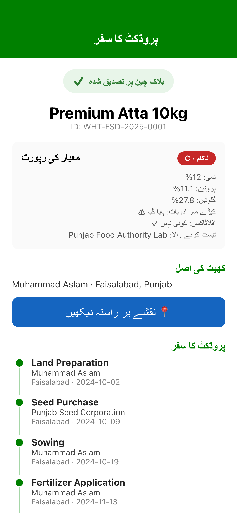 |  |

> Full Urdu localization with right‑to‑left (RTL) layout. Regenerate with
> `node scripts/capture-ur.js`. (Remaining: **QR Scanner** needs a camera/device.)

## 🔄 Traceability Workflow

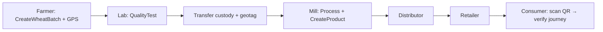

## 🙏 Funding Acknowledgment

> The authors gratefully acknowledge the financial support provided by the **Higher Education
> Commission (HEC), Pakistan**, under the **National Research Program for Universities (NRPU)**.

## 🎓 Research Project Information

| | |
|---|---|
| **Project** | AgroChain – A Wheat and Sugar Traceability Solution using IoT and Blockchain |
| **NRPU Project No.** | 15516 |
| **Funding Agency** | Higher Education Commission (HEC), Pakistan |
| **Host Institution** | Department of Computer Science / Precision Agriculture Lab, Center for Advanced Studies in Agriculture and Food Security, University of Agriculture Faisalabad, Pakistan |
| **Team / PI** | *To Be Completed by Project Team* |

## 📁 Project Structure

```
AgroChain/
├── App.js                 # Root: I18n → Auth → Sync → Navigation
├── Navigation/            # Stack + bottom-tab navigators (session-gated)
├── Screens/               # UI screens (Home, ProductJourney, LabDashboard, …)
├── Abstracts/             # Shared UI (Button, Input, Container, Theme, SyncStatusBar)
├── Services/              # api, SyncContext/SyncQueue, AuthContext, location, fraudDetection, config
├── i18n/                  # English + Urdu translations
├── Svgs/ · Images/ · assets/   # Icons and images
├── go/                    # Hyperledger Fabric chaincode (supplychain.go) + CouchDB indexes
├── org/                   # Node/Express gateway + CA enrollment (config via .env)
├── configtx/              # Fabric channel/org configuration
├── docs/                  # Full documentation + docs/reports/
├── app.json · eas.json    # Expo + EAS build config
└── package.json
```

## 🤝 Contributing

Contributions are welcome — see [`CONTRIBUTING.md`](CONTRIBUTING.md) and our
[`CODE_OF_CONDUCT.md`](CODE_OF_CONDUCT.md). For vulnerabilities, follow [`SECURITY.md`](SECURITY.md).

## 📚 Documentation

Full suite in [`docs/`](docs/): Project Overview, System & Fabric Architecture, Transaction
Flow, Chaincode, Android App, API, Database, Deployment, Installation, User & Administrator
Manuals, Security Overview, Troubleshooting, Code Review, and research reports in
[`docs/reports/`](docs/reports/). Changelog: [`CHANGELOG.md`](CHANGELOG.md).

## 📄 License

This project is licensed under the MIT License. See the LICENSE file for details.

---

<div align="center">
Developed under HEC NRPU Project No. 15516 · University of Agriculture Faisalabad
</div>
