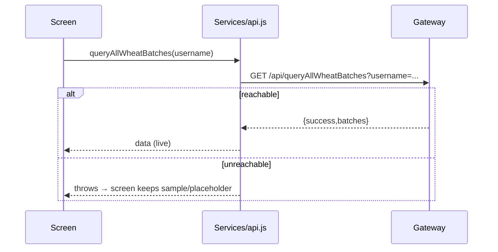

# API Documentation — AgroChain Gateway

REST gateway: [`org/serverOrg1.js`](../org/serverOrg1.js) · Base URL (dev) `http://localhost:8081`
(Android emulator `http://10.0.2.2:8081`). Production URL is configured via
`app.json → expo.extra.apiBaseUrl` and read in `Services/config.js`.

All requests/responses are JSON. Write endpoints map to chaincode `submitTransaction`;
read endpoints map to `evaluateTransaction`. Each call connects via the user's wallet
identity (the `username` parameter).

## 1. Authentication

### `POST /api/login`
Verifies credentials against Fabric CA (enroll) and caches the X.509 identity in the wallet.
```json
// request
{ "username": "farmer01", "password": "secret" }
// 200
{ "success": true, "username": "farmer01" }
// 401
{ "success": false, "message": "Invalid username or password" }
```

### `POST /api/registerenrolluserorg1/`
Registers + enrolls a new client identity (admin‑bootstrapped).
```json
{ "username": "farmer01" }
```

## 2. Wheat batches

| Method | Path | Body / Query | Chaincode |
|--------|------|--------------|-----------|
| POST | `/api/createWheatBatch` | `{username,entityID,wheatBatchID,variety,quantity,harvestDate,qrCode,latitude,longitude}` | `CreateWheatBatch` |
| POST | `/api/sendWheatBatch` | `{username,wheatBatchID,senderEntityID,newHolderID,latitude,longitude}` | `SendWheatBatch` |
| GET | `/api/queryWheatBatch` | `?username&wheatBatchID` | `QueryWheatBatch` |
| GET | `/api/queryAllWheatBatches` | `?username` | `QueryAllWheatBatches` |

## 3. Products & movements

| Method | Path | Body / Query | Chaincode |
|--------|------|--------------|-----------|
| GET | `/api/queryProduct` | `?username&productID` | `QueryProduct` |
| GET | `/api/queryAllProducts` | `?username` | `QueryAllProducts` |
| GET | `/api/queryProductMovements` | `?username&productID` | `QueryProductMovements` |

## 4. Quality reports

| Method | Path | Body / Query | Chaincode |
|--------|------|--------------|-----------|
| POST | `/api/recordQualityTest` | `{username,reportID,subjectID,labID,testedBy,testDate,moisture,protein,gluten,pesticides,aflatoxin,result,grade,certHash}` | `RecordQualityTest` |
| GET | `/api/queryQualityReports` | `?username&subjectID` | `QueryQualityReportsBySubject` |
| GET | `/api/queryAllQualityReports` | `?username` | `QueryAllQualityReports` |

## 5. Consumer

| Method | Path | Body | Chaincode |
|--------|------|------|-----------|
| POST | `/api/reportConsumerIssue` | `{username,productID,district,issueFlag,issueDesc}` | `RecordConsumerScan` |

## 6. Standard responses

```json
{ "success": true,  "...": "data" }
{ "success": false, "message": "error text" }
```
HTTP codes: `200` ok, `201` created, `400` bad request, `401` auth, `500/501` server.

## 7. Client SDK (mobile)

`Services/api.js` wraps these endpoints with a `fetch` helper (timeout via
`AbortController`), an `Actions` registry for offline‑queued writes, and typed query
helpers. Write actions: `CREATE_WHEAT_BATCH`, `SEND_WHEAT_BATCH`, `REPORT_CONSUMER_ISSUE`,
`RECORD_QUALITY_TEST`.

## 8. Sequence (read with offline fallback)



## 9. Gaps

- No gateway servers for Punjab/Mill/Dealer/Retailer orgs yet (**To Be Completed**).
- No rate limiting / API gateway / HTTPS termination in the repo (add a reverse proxy in prod).
