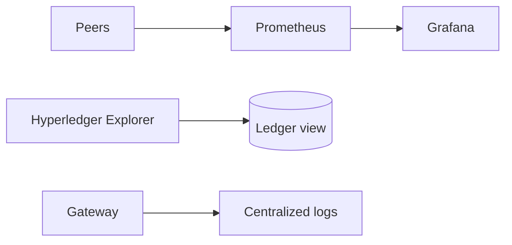

# Administrator Manual — AgroChain

Audience: network/system administrators operating the Fabric network, CA, gateway, and app
releases.

## 1. Responsibilities

- Operate the Fabric network (orderers, peers, CouchDB).
- Manage identities via Fabric CA (register/enroll/revoke).
- Run and monitor the REST gateway.
- Manage chaincode lifecycle (upgrades).
- Build and publish app releases.

## 2. Identity & access management

```bash
cd org
node enrollAdminOrg1.js              # one-time: enroll CA admin into walletOrg1/
node registerEnrollClientUserOrg1.js # register/enroll a client (or POST /api/registerenrolluserorg1)
```
- New users log in via `POST /api/login` (CA enroll verifies credentials).
- **Revocation:** revoke a user's certificate at the CA and regenerate CRLs. Procedure:
  **To Be Completed by Project Team** (depends on your CA deployment).
- MSP IDs: identities issued under `FarmerOrg1MSP`; role‑restricted chaincode requires the
  correct org/role (e.g., a **lab** identity for `RecordQualityTest`, `MillOrg4MSP` for mills).

## 3. Chaincode upgrades

1. Edit `go/supplychain.go` (and add CouchDB indexes if new queries).
2. Bump `--sequence`/`--version`; run package → install → approve → commit (see Deployment Guide).
3. Verify with `peer lifecycle chaincode querycommitted`.

## 4. Gateway operations

- Run under pm2/systemd; containerize for production.
- Front with TLS reverse proxy; restrict origins; add rate limiting (recommended).
- Health: `GET /` → `Test Pass!...`.
- Secrets: keep `connection-org1.json` and `walletOrg1/` private (never commit; see `.gitignore`).

## 5. Monitoring (recommended)


- Hyperledger Explorer for blocks/tx; Prometheus/Grafana for peer/orderer metrics.
- Centralize gateway logs (currently `console.*`; route to a log aggregator).

## 6. Backups

| Asset | Action |
|-------|--------|
| Peer ledgers / CouchDB volumes | Scheduled volume snapshots |
| CA database | Back up CA home/db |
| Wallet (`walletOrg1/`) | Encrypted, access‑controlled backup (private keys!) |
| `connection-*.json` | Secrets store |

## 7. App release management

- Set `app.json → extra.apiBaseUrl` to the production gateway.
- Bump `expo.version`; EAS auto‑increments `versionCode`.
- `eas build --profile production` → upload AAB (see `STORE.md`, `DATA_SAFETY.md`).

## 8. Disaster recovery

- CouchDB world state can be rebuilt from the ledger; protect ledger + CA + wallet.
- Document RTO/RPO targets and a restore runbook: **To Be Completed by Project Team**.

## 9. Operational checklist

- [ ] Orderers healthy / quorum maintained
- [ ] All peers joined to `supplychain-channel`
- [ ] Chaincode committed at expected sequence
- [ ] Gateway reachable over HTTPS
- [ ] Backups verified (restore test)
- [ ] CA admin credentials rotated and stored securely
