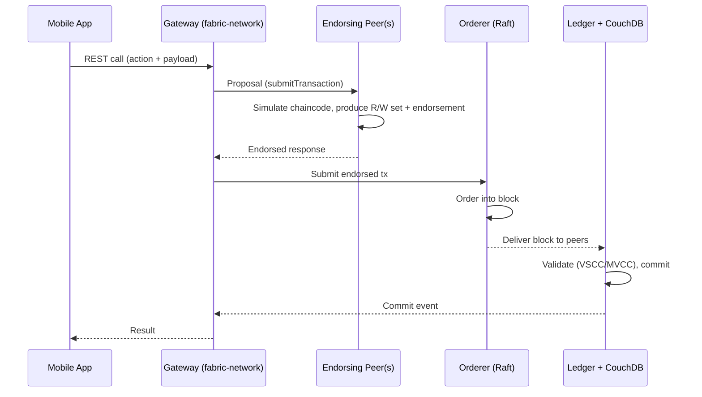
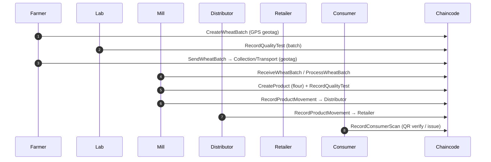
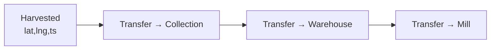
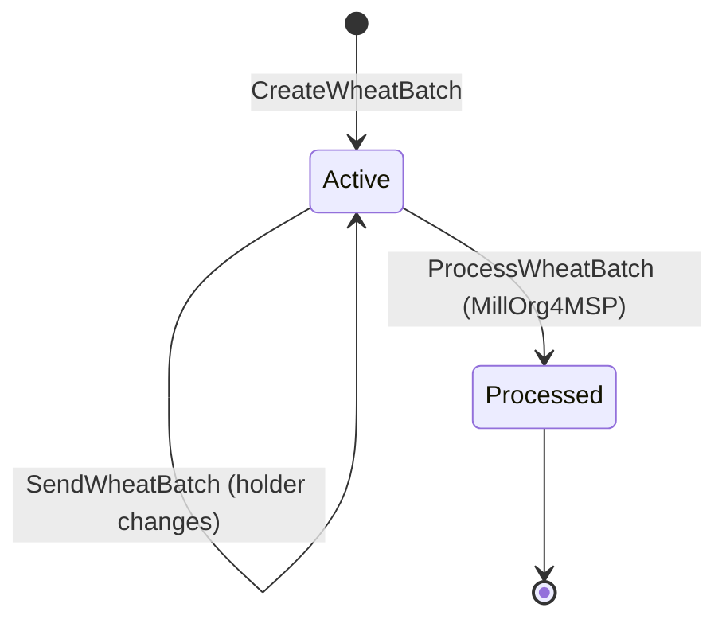

# Blockchain Transaction Flow — AgroChain

## 1. Generic Fabric transaction lifecycle

- **submitTransaction** → write path (endorse → order → commit).
- **evaluateTransaction** → read path (query a peer; no ordering).

## 2. End‑to‑end traceability flow (wheat example)

## 3. Custody & geotag trail

`CreateWheatBatch` seeds `CustodyHistory` with a `Harvested` GeoPoint; each `SendWheatBatch`
appends a geotagged `Transferred to <id>` point (timestamp from the tx). The mobile
`ProductJourney` reads this to render the map route.

## 4. State transitions (WheatBatch)

## 5. Determinism notes

- Transaction IDs for product movements are SHA‑256 of
  `productID-senderID-receiverID-date-quantity` (idempotent).
- Timestamps use `GetTxTimestamp()` (deterministic across endorsers) — **never**
  `time.Now()` inside chaincode.
