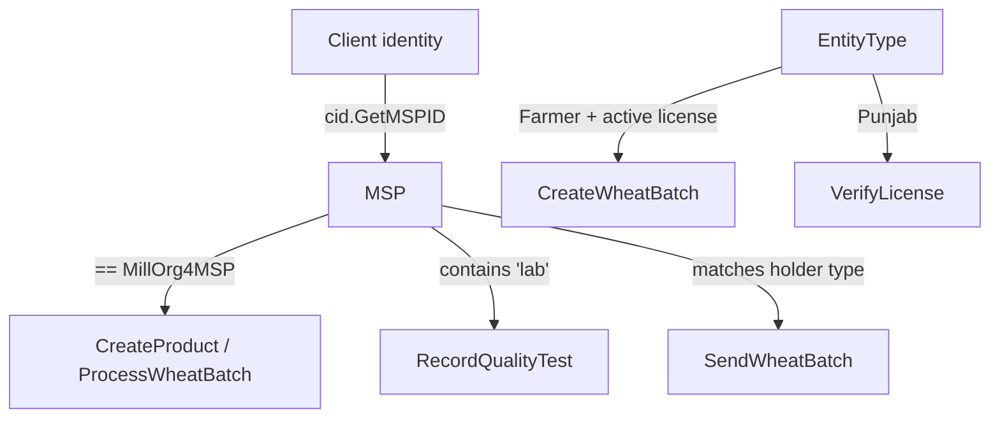

# Chaincode Documentation — `supplychain`

Language: **Go** (`github.com/hyperledger/fabric-contract-api-go`).
File: [`go/supplychain.go`](../go/supplychain.go). Contract: `SmartContract`.

## 1. Data models (structs)

| Struct | Key fields | Notes |
|--------|-----------|-------|
| `Entity` | id, name, email, entityType, licenseID | Participant (Farmer/Mill/Punjab/…) |
| `License` | licenseID, entityID, number, issued/expiry, status, type | Linked to entity |
| `WheatBatch` | wheatBatchID, variety, quantity, farmerID, harvestDate, currentHolder, qrCode, status, **farmLatitude/Longitude**, **custodyHistory[]** | Core traceable unit |
| `GeoPoint` | label, holderID, latitude, longitude, timestamp | Custody trail entry |
| `Product` | productID, wheatBatchID, production/expiry, qrCode, productName, productType | Flour/sugar product |
| `QualityReport` | reportID, subjectID, labID, testedBy, moisture, protein, gluten, pesticides, aflatoxin, result, grade, certHash | Lab results |
| `ProductMovement` | transactionID, productID, sender/receiver, quantity, date | Custody transfer record |
| `ConsumerScan` | scanID, productID, scanTime, district, issueFlag, issueDesc | Consumer verification/issue |
| `WheatCert` | variety, qualityFactor, protein, holder, weight, buyer, date | Certificate metadata |

## 2. Functions (transactions)

### Participants & licensing
| Function | Type | Access | Description |
|----------|------|--------|-------------|
| `CreateEntity(id,name,mail,entityType)` | write | open | Register a participant |
| `QueryEntityByName(name)` | read | open | Find entities by name |
| `QueryAllEntities()` | read | open | All entities |
| `StoreLicense(licenseID,entityID,number,issued,expiry,status,type)` | write | Farmer entity | Issue & link license |
| `LicenseExists(licenseID)` | read | open | Existence check |
| `VerifyLicense(licenseID,verifierEntityID)` | read | verifier=Punjab | Validate active farmer license |

### Wheat batch lifecycle
| Function | Type | Access | Description |
|----------|------|--------|-------------|
| `CreateWheatBatch(entityID,batchID,variety,qty,harvestDate,qrCode,lat,lng)` | write | Farmer + active license | Create batch + seed geotag trail |
| `SendWheatBatch(batchID,senderID,newHolderID,lat,lng)` | write | caller MSP matches holder type | Transfer custody + append GeoPoint |
| `ReceiveWheatBatch(batchID,receiverID,dateReceived)` | write | receiver = current holder | Confirm receipt |
| `ProcessWheatBatch(batchID,flourType)` | write | `MillOrg4MSP` | Mark processed |
| `QueryWheatBatch(batchID)` | read | open | Single batch (incl. custody history) |
| `QueryAllWheatBatches()` | read | open | All batches |

### Products & movements
| Function | Type | Access | Description |
|----------|------|--------|-------------|
| `CreateProduct(productID,batchID,prodDate,expiry,qrCode,name,type)` | write | `MillOrg4MSP` | Create flour/sugar product |
| `RecordProductMovement(productID,sender,receiver,qty,date)` | write | open | Movement (deterministic txID) |
| `QueryProduct(productID)` | read | open | Single product |
| `QueryAllProducts()` | read | open | All products |
| `QueryProductMovements(productID)` | read | open | Movements for a product |
| `AggregateProductQuantities(productID)` | read | open | Net qty per entity |

### Quality & consumer
| Function | Type | Access | Description |
|----------|------|--------|-------------|
| `RecordQualityTest(reportID,subjectID,labID,testedBy,date,moisture,protein,gluten,pesticides,aflatoxin,result,grade,certHash)` | write | MSP contains `lab` | Record lab report |
| `QueryQualityReportsBySubject(subjectID)` | read | open | Reports for a batch/product |
| `QueryAllQualityReports()` | read | open | All reports |
| `RecordConsumerScan(productID,district,issueFlag,issueDesc)` | write | open | Consumer scan/issue (key `scan_<txID>`) |
| `QueryConsumerScans(productID)` | read | open | Scans for a product |

## 3. Access‑control model

## 4. Events

- `SendWheatBatch` emits `WheatBatchTransferred` (payload = batchID) for downstream listeners.

## 5. Rich queries (CouchDB selectors)

Examples used by the contract:
- `{"selector":{"docType":"WheatBatch"}}`
- `{"selector":{"docType":"ProductMovement","productID":"<id>"}}`
- `{"selector":{"docType":"QualityReport","subjectID":"<id>"}}`
- `{"selector":{"entityType":{"$exists":true}}}`

Backed by indexes in `go/META-INF/statedb/couchdb/indexes/` (see Database Documentation).

## 6. Upgrade & lifecycle

After any chaincode change, redeploy with a **bumped sequence** (Fabric v2 lifecycle):
`package → install → approveformyorg → commit`. See Deployment Guide.

## 7. Testing recommendation

Unit tests with `contractapi` test stubs (e.g., `MockStub`) are **To Be Completed by
Project Team**; add coverage for access‑control branches and query selectors.
