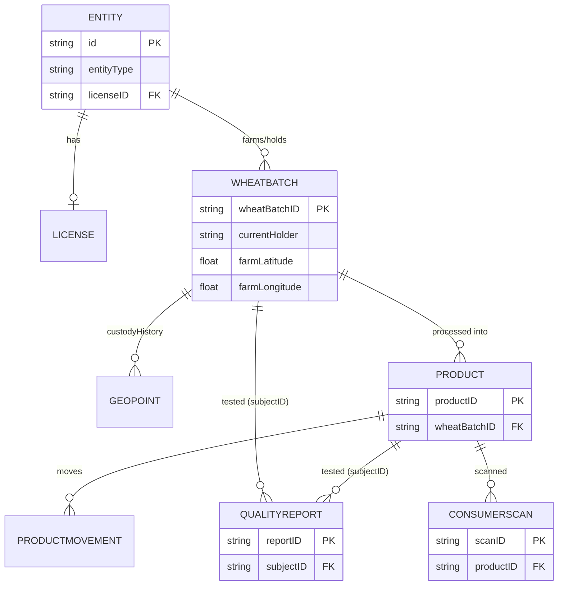

# Database Documentation — AgroChain

AgroChain uses **CouchDB** as the Hyperledger Fabric **world‑state** database (one instance
per peer), enabling JSON rich queries. The blockchain itself is the immutable transaction
log; CouchDB holds the current state for efficient reads.

## 1. Document types (`docType`)

| docType | Source struct | Key |
|---------|---------------|-----|
| `WheatBatch` | WheatBatch | `wheatBatchID` |
| `Product` | Product | `productID` |
| `ProductMovement` | ProductMovement | deterministic SHA‑256 txID |
| `QualityReport` | QualityReport | `reportID` |
| `ConsumerScan` | ConsumerScan | `scan_<txID>` |
| (Entity) | Entity | `id` (discriminated by `entityType`) |
| (License) | License | `licenseID` |

## 2. Indexes

Located in [`go/META-INF/statedb/couchdb/indexes/`](../go/META-INF/statedb/couchdb/indexes/),
deployed automatically with the chaincode package.

| File | Fields | Serves |
|------|--------|--------|
| `entityIndex.json` | `name` | `QueryEntityByName` |
| `productMovIndex.json` | `docType, productID` | `QueryProductMovements`, `AggregateProductQuantities` |
| `qualityReportIndex.json` | `docType, subjectID` | `QueryQualityReportsBySubject`, `QueryAllQualityReports` |
| `consumerScanIndex.json` | `docType, productID` | `QueryConsumerScans` |

> CouchDB can use a left‑prefix of a composite index, so `qualityReportIndex` (docType,
> subjectID) also serves the docType‑only `QueryAllQualityReports` selector.

## 3. Entity‑relationship (logical)

## 4. Client‑side storage (mobile)

`AsyncStorage` keys (device‑local, not the ledger):

| Key | Purpose |
|-----|---------|
| `@agrochain/sync_queue` | Offline write queue |
| `@agrochain/session` | Auth session (username only) |
| `@agrochain/language` | EN/UR preference |

## 5. Backup & retention

- **On‑chain** records are immutable and permanent (by design).
- **CouchDB** can be reconstructed from the ledger; still back up peer volumes.
- Off‑chain wallet (`org/walletOrg1/`) must be backed up securely (contains private keys).
- Retention/cleanup of off‑chain data: **To Be Completed by Project Team**.

## 6. Indexing guidance

When adding new rich queries, add a matching index JSON under the META‑INF path and
redeploy the chaincode so CouchDB builds it; otherwise queries fall back to slow full scans.
