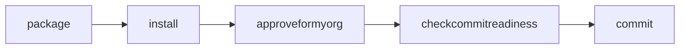
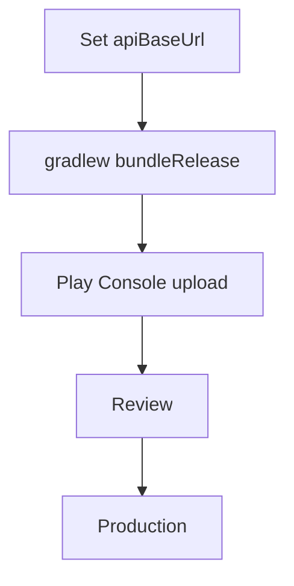

# Deployment Guide — AgroChain

End‑to‑end deployment of the three tiers: Fabric network → gateway → mobile app.

## 1. Prerequisites

- Docker + Docker Compose, Go 1.15+, Fabric 2.x binaries (`peer`, `configtxgen`, `cryptogen`)
- Node.js 18+, Xcode (iOS builds) and/or Android Studio/Gradle (Android builds)
- A Linux host (cloud VM) with public DNS + TLS for the gateway

## 2. Fabric network bring‑up

> Network orchestration scripts (cryptogen config, docker‑compose, channel scripts) are
> **To Be Completed by Project Team**. The steps below are the standard Fabric v2 flow that
> matches [`configtx/configtx.yaml`](../configtx/configtx.yaml).

```bash
# 1. Crypto material (CAs/MSPs/TLS) for all orgs
cryptogen generate --config=crypto-config.yaml

# 2. Genesis block + channel tx
configtxgen -profile <OrdererProfile> -channelID system-channel -outputBlock genesis.block
configtxgen -profile <AppChannelProfile> -outputCreateChannelTx supplychain-channel.tx

# 3. Start containers (orderers, peers, CouchDB, CAs)
docker-compose up -d

# 4. Create & join channel (per peer)
peer channel create -c supplychain-channel -f supplychain-channel.tx
peer channel join -b supplychain-channel.block
# 5. Anchor peer updates per org
```

## 3. Chaincode deployment (Fabric v2 lifecycle)

```bash
peer lifecycle chaincode package supplychain.tar.gz --path ./go --lang golang --label supplychain_1
peer lifecycle chaincode install supplychain.tar.gz                 # each peer
peer lifecycle chaincode approveformyorg --channelID supplychain-channel \
  --name supplychain --version 1 --sequence 1 --package-id <id>     # each org
peer lifecycle chaincode checkcommitreadiness --name supplychain --version 1 --sequence 1
peer lifecycle chaincode commit --channelID supplychain-channel --name supplychain \
  --version 1 --sequence 1
```

> **On every chaincode change, bump `--sequence` (and `--version`)** and repeat
> install/approve/commit. CouchDB indexes under `go/META-INF` deploy with the package.



## 4. Gateway deployment

```bash
cd org
npm install
# place connection-org1.json (from the network) here
node enrollAdminOrg1.js                 # enroll CA admin → walletOrg1/
node serverOrg1.js                      # REST API on :8081
```
- Put a **reverse proxy (Nginx/Caddy) with TLS** in front; expose HTTPS publicly.
- Identities use MSP `FarmerOrg1MSP`; CA key `ca.farmerorg1.supplychain.com`.
- Run under a process manager (pm2/systemd) and containerize for production.

## 5. Mobile app release

```bash
npm install
npx expo install   # ensures native deps match SDK 50
# Set the public backend URL:
#   app.json → expo.extra.apiBaseUrl = "https://api.<your-domain>"
npx expo prebuild --platform android --clean
cd android && ./gradlew bundleRelease   # produces .aab (requires a release keystore — see STORE.md)
```
Then submit per `STORE.md` (first AAB uploaded manually in Play Console).



## 6. Environment matrix

| Env | apiBaseUrl | Fabric | Notes |
|-----|-----------|--------|-------|
| Dev | localhost:8081 / 10.0.2.2 | local docker | `npx expo start` |
| Staging | https://staging‑api… | staging net | internal testing track |
| Prod | https://api… | prod net | production track |

## 7. Post‑deploy checks

- `GET /` on gateway returns `Test Pass!...`
- Login works (`POST /api/login`)
- A create + query round‑trips on the ledger
- App (release build) reaches the public backend (not localhost)
