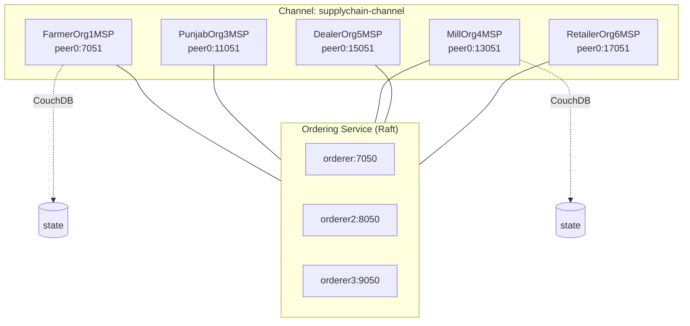

# Hyperledger Fabric Architecture — AgroChain

Source of truth: [`configtx/configtx.yaml`](../configtx/configtx.yaml),
[`go/supplychain.go`](../go/supplychain.go).

## 1. Network organizations (as configured)

| Org | MSP ID | Role | Anchor peer (host:port) |
|-----|--------|------|--------------------------|
| OrdererOrg | `OrdererMSP` | Ordering service | orderer/orderer2/orderer3.supplychain.com :7050/8050/9050 |
| FarmerOrg1 | `FarmerOrg1MSP` | Farmers | peer0.farmerorg1.supplychain.com:7051 |
| PunjabOrg3 | `PunjabOrg3MSP` | Punjab Food Dept (regulator/verifier) | peer0.punjaborg3.supplychain.com:11051 |
| MillOrg4 | `MillOrg4MSP` | Flour/Sugar mills (processors) | peer0.millorg4.supplychain.com:13051 |
| DealerOrg5 | `DealerOrg5MSP` | Dealers/distributors | peer0.dealerorg5.supplychain.com:15051 |
| RetailerOrg6 | `RetailerOrg6MSP` | Retailers | peer0.retailerorg6.supplychain.com:17051 |

- **Channel:** `supplychain-channel`
- **Chaincode:** `supplychain`
- **Capabilities:** Channel/Orderer/Application `V2_0`
- **Ordering:** Raft (3 orderer endpoints declared)

## 2. Membership & identity (MSP)

- Each org has an MSP defining Readers/Writers/Admins/Endorsement signature policies.
- Identities are X.509 certs issued by **Fabric CA** and stored in a file‑system **wallet**.
- The gateway (`org/serverOrg1.js`) authenticates users via CA enroll and signs
  transactions with `FarmerOrg1MSP` identities.

## 3. Endorsement & policies

- Application‑level policies use `ImplicitMeta`:
  - Readers: `ANY Readers`, Writers: `ANY Writers`, Admins: `MAJORITY Admins`
  - Lifecycle/Endorsement: `MAJORITY Endorsement`
- Per‑org Endorsement signature rule: `OR('<MSP>.peer')`.

## 4. Chaincode‑level authorization (defense in depth)

The smart contract enforces role rules using the caller's MSP ID (`cid` package):

| Function | Restriction |
|----------|-------------|
| `CreateProduct`, `ProcessWheatBatch` | `MillOrg4MSP` only |
| `RecordQualityTest` | MSP containing `lab` (accredited labs) |
| `SendWheatBatch` | caller MSP must match the batch holder's entity type |
| `VerifyLicense` | verifier entity type must be `Punjab` |
| `StoreLicense`, `CreateWheatBatch` | entity must be type `Farmer` (+ active license) |

## 5. Ledger model

- **World state:** CouchDB (per‑peer), enabling JSON rich queries.
- **Blockchain:** immutable ordered log of transactions.
- **Keys:** entity/batch/product/license IDs; movements keyed by deterministic SHA‑256
  transaction ID; consumer scans keyed by `scan_<txID>`.

## 6. Private data (recommendation)

The current chaincode stores commercial fields (e.g., quantities) in the public state.
For production, sensitive commercial terms/prices should move to **Private Data
Collections** scoped to the transacting orgs + regulator. **To Be Completed by Project Team.**

## 7. Scaling notes

- Add `peer1` per org for redundancy.
- Consider per‑commodity channels (wheat/sugar) and a regulator audit channel for stronger
  data isolation (architectural option; not in current `configtx`).
