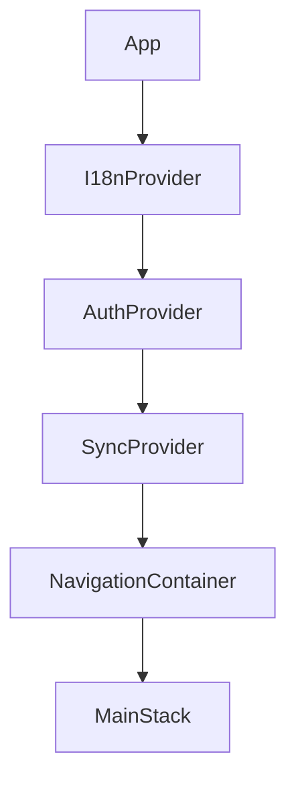
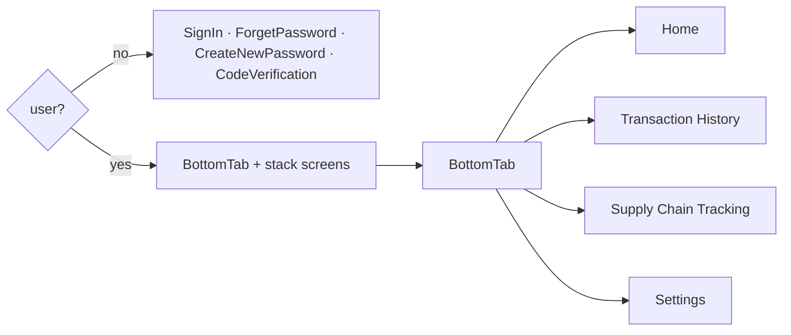

# Mobile Application Documentation (Android & iOS) — AgroChain

Framework: **React Native 0.73 / Expo SDK 50** — a single codebase running on **Android**,
**iOS**, and the **web** (via `react-native-web`). App ID / bundle identifier:
`com.agrochain.app`.

## Platform support

| Platform | Min target | Distribution | Maps | Build requirement |
|----------|-----------|--------------|------|-------------------|
| Android | 6.0+ (API 23) | Google Play (AAB) | Google Maps | any OS + EAS |
| iOS | 13.4+ | App Store (IPA) | Apple Maps | macOS + Xcode (or EAS) |
| Web | modern browsers | static hosting | — | any OS |

iOS permissions are declared in `app.json → ios.infoPlist`
(`NSCameraUsageDescription`, `NSLocationWhenInUseUsageDescription`).

## 1. Entry & provider tree

`App.js` composes global providers, then the navigator:

- **I18nProvider** (`i18n/`) — EN/UR translations, `t()`, RTL, persisted choice.
- **AuthProvider** (`Services/AuthContext.js`) — CA‑backed login, persisted session, route gating.
- **SyncProvider** (`Services/SyncContext.js`) — connectivity + offline queue + auto‑flush.

## 2. Navigation

`Navigation/MainStack.js` gates by session:

Stack screens (authenticated): BottomTab, Add/Valid Farmer, Add/Valid Mill, Add/Valid Crop,
CameraScreen, ProductDetail, MapScreen, QRScanner, FAQs, ProductJourney, FraudAlerts,
LabDashboard, About.

## 3. Screen catalog

| Screen | Purpose |
|--------|---------|
| `Home` | Card‑based KPI dashboard (live), quick actions |
| `Crop/Add` | Register wheat batch (GPS geotag, offline‑aware) |
| `Farmer/*`, `Mill/*` | Entity add/validation forms |
| `QRScanner` | Scan product QR → ProductJourney |
| `ProductJourney` | Consumer trust: verified badge, quality, timeline, map route, report issue |
| `MapScreen` | GPS custody route (markers + polyline) |
| `LabDashboard` | Record quality test (lab role) |
| `FraudAlerts` | Anomaly/quality alerts |
| `SupplyChainTracking` | Product list → journey |
| `Settings` | Language toggle, About, logout |
| `About` | Academic acknowledgment (HEC/UAF/NRPU 15516) |
| `Account/*` | Sign in, forgot/reset password, OTP |

## 4. Services layer (`Services/`)

| Module | Responsibility |
|--------|----------------|
| `config.js` | Env‑driven `API_BASE_URL` (via `expo-constants`), timeouts, default user |
| `api.js` | REST wrapper, `Actions` registry, query helpers |
| `SyncQueue.js` | Persistent offline write queue (AsyncStorage) |
| `SyncContext.js` | Online state, `submit()`, auto‑flush on reconnect |
| `AuthContext.js` | Login/logout, persisted session |
| `location.js` | GPS capture (`expo-location`) with graceful fallback |
| `fraudDetection.js` | Rule engine (weight/extraction/duplicate/quality) |

## 5. Shared UI (`Abstracts/`)

`Container`, `Button`, `TextInput`, `Backward`, `SyncStatusBar`, `Theme` (Colors, FontSize).
Responsiveness via `Dimensions` ratios + `FontSize` scale; cards cap width for tablet/web.

## 6. Internationalization

`i18n/translations.js` holds EN + UR dictionaries (key parity enforced). RTL handled via
`I18nManager`. Add a key to **both** dictionaries when introducing UI text.

## 7. Permissions

`app.json` declares Camera (QR) and Location (geotag) for iOS (`infoPlist`) and Android
(`permissions`) plus the `expo-camera`/`expo-location` config plugins.

## 8. Build

- Dev: `npx expo start`
- Release: `cd android && ./gradlew bundleRelease` (AAB). See Deployment Guide.

## 9. Screenshots

English captures are stored in [`store/screenshots/en/`](../store/screenshots/en/) and
embedded in the root `README.md`: Home dashboard, Add Crop, Supply Chain Tracking, Settings
(EN/UR toggle), About (acknowledgment), and Fraud Alerts.

**Remaining (To Be Completed by Project Team):** **QR Scanner**, **Product Journey**, and
**Map route** require the camera / native maps (capture on an emulator/simulator or a real
device), plus the full **Urdu (UR)** set. A helper script is provided:
`node scripts/capture-screenshots.js` (drives the running web build via Chrome).
