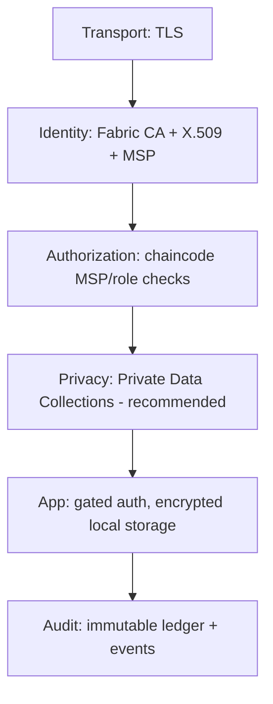

# Security Overview — AgroChain

## 1. Security model (layers)

## 2. Identity & authentication

- **Fabric CA** issues X.509 identities; the gateway authenticates users via `ca.enroll`
  (`POST /api/login`). Only the **username** is persisted on the device; the password is not.
- Mobile app is **route‑gated**: unauthenticated users see only the auth flow.

## 3. Authorization (defense in depth)

- Channel/MSP policies (configtx) govern read/write/endorse.
- Chaincode enforces role rules (e.g., `MillOrg4MSP` for product creation, `lab` MSP for
  quality reports, holder‑type check for transfers).

## 4. Data protection

- **In transit:** TLS between Fabric nodes; HTTPS for the gateway (terminate at a proxy).
- **At rest:** ledger immutability; CouchDB on protected volumes; wallet holds private keys
  (must be encrypted/access‑controlled).
- **On device:** session/queue/language in app‑sandboxed AsyncStorage.

## 5. Privacy

- Consumer scans are anonymized (district‑level, no PII).
- **Recommendation:** move commercial/price fields to **Private Data Collections** scoped to
  transacting orgs + regulator. Currently commercial fields are public. **To Be Completed.**

## 6. Known issues & hardening backlog

| # | Issue | Severity | Recommendation |
|---|-------|----------|----------------|
| 1 | `enrollAdmin` uses hardcoded `admin/adminpw` | High | Move to env/secret manager; rotate |
| 2 | Gateway has no rate limiting / CORS / helmet | Medium | Add `helmet`, CORS allowlist, rate limiter |
| 3 | No HTTPS in repo (plain `:8081`) | High (prod) | Terminate TLS at reverse proxy |
| 4 | `verify: false` on CA TLS in enroll scripts | Medium | Use proper CA TLS roots in prod |
| 5 | Password reset flow is UI‑only (no backend) | Medium | Implement secure reset + OTP backend |
| 6 | No PDC for commercial data | Medium | Add Private Data Collections |
| 7 | `console.*` logging only | Low | Structured logging + centralization |
| 8 | No input validation/sanitization at gateway | Medium | Validate/whitelist all params |
| 9 | Secrets files must stay untracked | — | Verified in `.gitignore` |

## 7. Secrets management

- `connection-org1.json`, `walletOrg1/`, `play-service-account.json`,
  `google-services.json`, `credentials.json` are **git‑ignored**. Keep CA admin secrets and
  enrollment secrets in a vault.

## 8. Compliance

- Privacy policy provided (`PRIVACY.md` / `privacy.html`); Play **Data Safety** answers in
  `DATA_SAFETY.md`. Camera used live (not stored); Location used only at capture time.

## 9. Incident response

- Use the immutable ledger + `WheatBatchTransferred` events for forensic trace.
- Regulator functions (recall/flagging) recommended as a follow‑up. **To Be Completed.**
