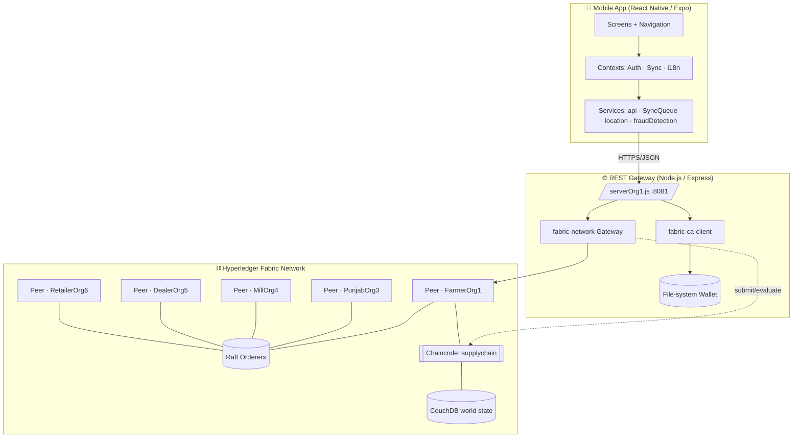
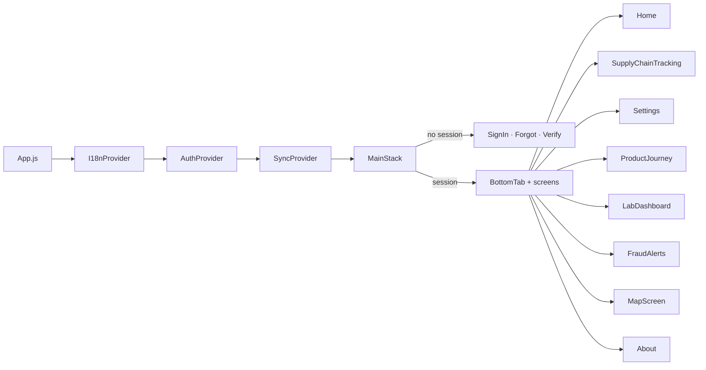
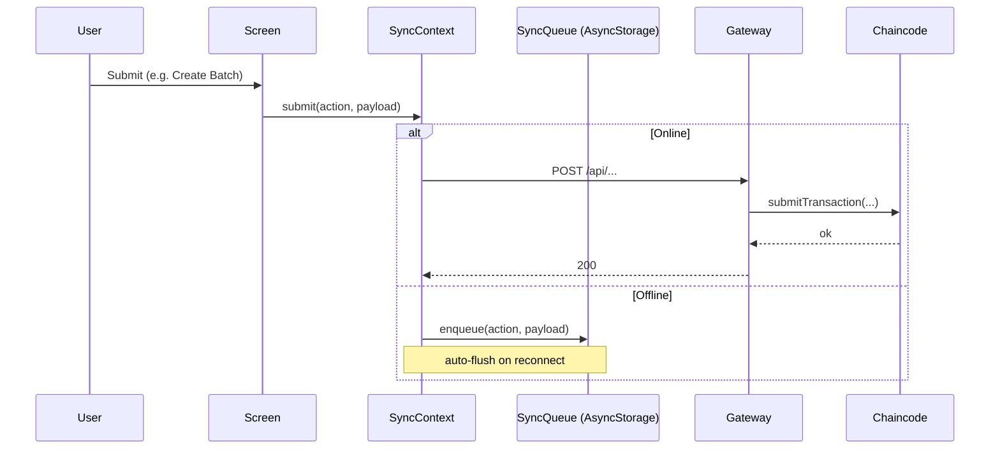
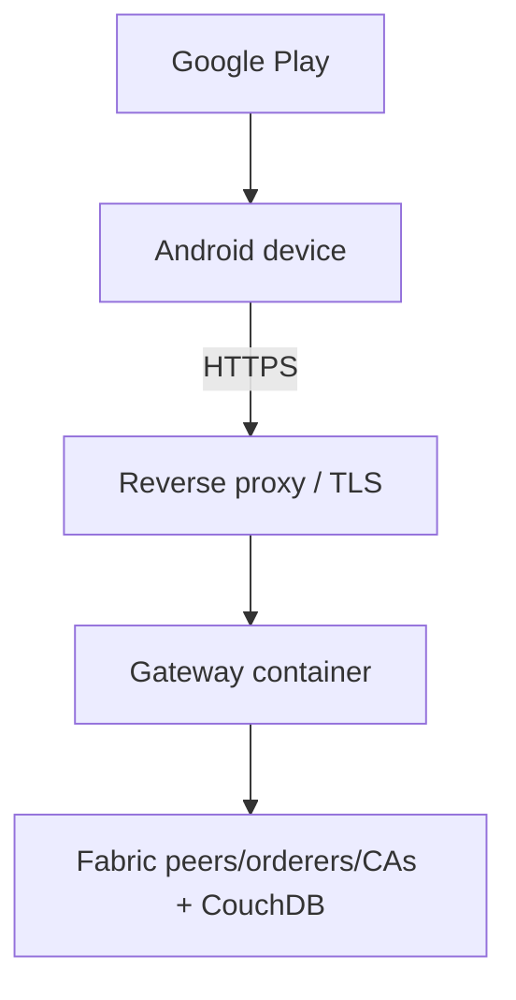

# System Architecture Document — AgroChain

## 1. High‑level architecture

AgroChain is a three‑tier system: a **mobile client**, a **REST gateway**, and a
**Hyperledger Fabric network** with CouchDB state databases.

## 2. Components

| Layer | Technology | Responsibility |
|-------|-----------|----------------|
| Mobile client | React Native 0.73 / Expo SDK 50 | UI, offline queue, GPS/QR capture, i18n |
| Gateway | Node.js + Express + `fabric-network` + `fabric-ca-client` | Auth (CA enroll), REST→chaincode bridge, wallet |
| Smart contract | Go (`fabric-contract-api-go`) | Business rules, access control, ledger writes/queries |
| State DB | CouchDB | Rich JSON queries via indexes |
| Ordering | Raft (configtx) | Transaction ordering, block creation |
| Identity | Fabric CA + X.509 + MSP | Org/role identity and authorization |

## 3. Logical view (mobile app)

## 4. Data flow (write path, offline‑aware)

## 5. Deployment view

## 6. Non‑functional considerations

- **Availability:** multiple Raft orderers; peers per org (see Fabric Architecture doc).
- **Performance:** CouchDB indexes for all rich queries; client caching/placeholders.
- **Resilience:** offline‑first queue tolerates connectivity loss.
- **Security:** TLS in transit, MSP authorization, CA‑backed auth (see Security Overview).
- **Localization:** full EN/UR with RTL.

## 7. Known gaps / assumptions

- Only **Org1 (Farmer)** gateway server is implemented; peer gateways for other orgs are
  **To Be Completed by Project Team**.
- Network bootstrap (cryptogen, docker‑compose, channel creation) is referenced by
  `configtx/configtx.yaml` but the orchestration scripts are **To Be Completed**.
