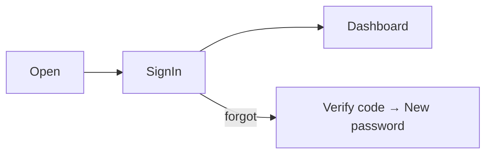

# User Manual — AgroChain

Audience: supply‑chain participants (farmers, mills, labs, …) and consumers.

## 1. Getting started

1. Install **AgroChain** from the Google Play Store (or a provided APK).
2. Open the app. Choose your language in **Settings → Language** (English / اردو) at any time.

## 2. Signing in

- Enter the **username** and **password** issued to you by your organization.
- Tap **Submit**. On success the dashboard opens; your session is remembered until you log out.
- Forgot password? Use **Forgot Password?** to reset via verification code.

## 3. Home dashboard

Shows live KPIs (batches created, in transit, delivered, products, quality pass‑rate,
quality flags) and quick actions. Tap **Quality Flags** to jump to Fraud Alerts.

## 4. Registering a crop/batch (farmers)

1. Quick action **New Batch** (Crop Produced).
2. Enter Crop ID, Address, Batch Number; pick the production date.
3. Tap **Add Crop**. The app captures your **GPS location** for the farm of origin.
4. Online → saved on the blockchain; offline → **queued** and synced automatically later
   (watch the colored sync bar).

## 5. Recording a quality test (labs)

1. Open **Record Quality Test** (Lab Dashboard).
2. Enter Report ID, Batch/Product ID, lab details; set moisture/protein/gluten; toggle
   pesticides/aflatoxin; choose grade and Pass/Fail.
3. Tap **Save Report**. (Requires a lab‑role identity.)

## 6. Consumer verification (no account needed in the consumer flow)

1. Tap **QR Scanner** and scan the code on a flour/sugar pack.
2. The **Product Journey** shows: "Verified on Blockchain" badge, quality results, farm
   origin, and the full timeline.
3. Tap **📍 View Route on Map** to see the GPS custody route.
4. Found a problem? Tap **Report Issue** to record it.

## 7. Supply chain tracking

**Supply Chain Tracking** lists products; tap any item to open its journey.

## 8. Offline use

Capture data anywhere. A banner shows **Offline / pending / syncing**. When connectivity
returns, queued items upload automatically; tap the bar to sync manually.

## 9. Settings

- **Language** — switch EN/UR (RTL applies after reload).
- **About** — project & funding acknowledgment.
- **Logout** — ends your session.

## 10. Tips

- Allow **Camera** and **Location** permissions for QR scanning and geotagging.
- Keep the app updated for the latest fraud‑detection and quality features.
