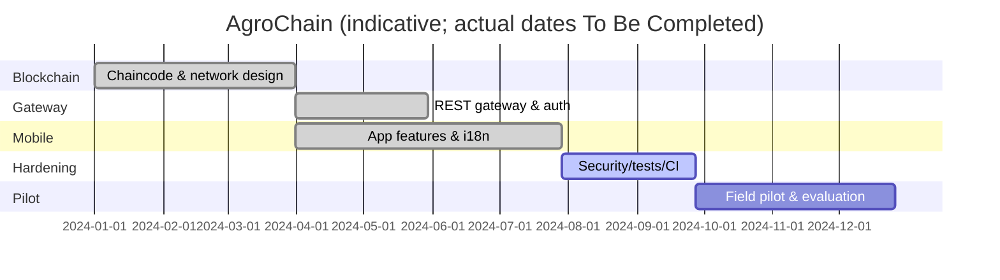

# Project Completion Report — AgroChain

**NRPU Project No. 15516** · HEC Pakistan · University of Agriculture Faisalabad

> Administrative fields (dates, budget, team roster, sanctioned vs utilized funds) are
> **To Be Completed by Project Team**.

## 1. Project particulars

| Field | Value |
|-------|-------|
| Title | AgroChain – A Wheat and Sugar Traceability Solution using IoT and Blockchain |
| Project No. | 15516 (NRPU) |
| Funding agency | Higher Education Commission (HEC), Pakistan |
| Host institution | University of Agriculture Faisalabad |
| Duration | *To Be Completed* |
| PI / Co‑PIs | *To Be Completed* |
| Total cost / utilized | *To Be Completed* |

## 2. Objectives vs achievement

| # | Objective | Status | Evidence |
|---|-----------|--------|----------|
| 1 | Immutable ledger of supply‑chain events | Achieved | `go/supplychain.go` (23 functions) |
| 2 | Role‑based authorization | Achieved | MSP/role checks in chaincode |
| 3 | Mobile app for participants + consumers | Achieved | `Screens/`, `Navigation/` |
| 4 | GPS/IoT geotagging | Partially achieved | GPS geotagging done; IoT sensor ingestion *To Be Completed* |
| 5 | Quality assurance + fraud detection | Achieved | `LabDashboard`, `fraudDetection.js`, chaincode quality reports |
| 6 | Offline + bilingual operation | Achieved | `SyncContext`, `i18n/` |

## 3. Deliverables

| Deliverable | Status |
|-------------|--------|
| Chaincode (Go) | Delivered |
| REST gateway (Org1) | Delivered |
| Mobile app (Android/iOS/web) | Delivered |
| CouchDB indexes | Delivered |
| Channel/org config | Delivered |
| Documentation suite (`docs/`) | Delivered |
| Play Store release config | Delivered |
| Network bootstrap automation | To Be Completed |
| Multi‑org gateways | To Be Completed |
| Field pilot | To Be Completed |

## 4. Methodology

Agile, iterative development across three tiers (chaincode → gateway → app), with
defense‑in‑depth authorization and offline‑first UX for rural conditions.

## 5. Work breakdown (high level)

## 6. Challenges & mitigations

| Challenge | Mitigation |
|-----------|------------|
| Rural connectivity | Offline‑first queue + auto‑sync |
| Low digital literacy | Urdu UI, icon‑driven actions |
| Trust across competitors | Permissioned ledger + MSP isolation |
| Data authenticity | Lab quality reports + fraud detection |

## 7. Financials & HR

*To Be Completed by Project Team.*

## 8. Conclusion

Core R&D objectives are met with a working, documented prototype. Remaining work is
production hardening, multi‑org rollout, and field evaluation.
