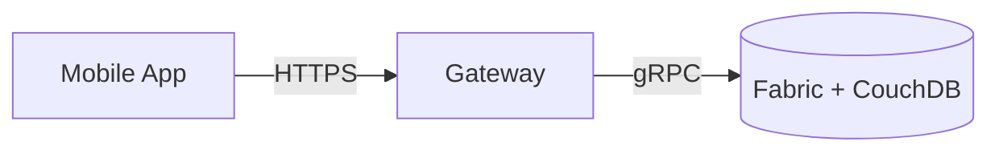

# Technical Report — AgroChain

**NRPU Project No. 15516** · HEC Pakistan · University of Agriculture Faisalabad

## 1. Introduction

This report details the technical design and implementation of AgroChain, a blockchain‑based
traceability platform for wheat and sugarcane in Pakistan.

## 2. System architecture

Three tiers — React Native app, Node/Express gateway, Hyperledger Fabric + CouchDB. See
[System Architecture](../System_Architecture.md) and
[Hyperledger Fabric Architecture](../Hyperledger_Fabric_Architecture.md).

## 3. Blockchain design

- **Network:** 5 member orgs (Farmer, Punjab, Mill, Dealer, Retailer) + Raft orderer;
  channel `supplychain-channel`; chaincode `supplychain`; Fabric v2 capabilities.
- **Smart contract:** Go, 23 transactions across entities, licensing, batches, products,
  movements, quality, and consumer scans. Authorization via MSP/role and entity‑type checks.
- **State:** CouchDB with four rich‑query indexes.
- **Traceability data:** geotagged custody history on each batch; deterministic movement IDs.

## 4. Application design

- React Native (Expo SDK 50); contexts for Auth (CA‑backed), Sync (offline‑first), i18n.
- Consumer trust layer renders verified product journey + GPS route map.
- Fraud detection rule engine (weight variance, extraction ratio, duplicate QR, quality
  failure) on client; mirrors recommended chaincode checks.

## 5. Algorithms & rules

- **Extraction‑ratio plausibility:** flour/wheat within [0.6, 0.85].
- **Weight variance:** >2% pickup→delivery flagged.
- **Duplicate QR:** same product scanned across multiple districts → counterfeit signal.
- **Quality failure:** lab `Fail`/contamination → high‑severity alert.

## 6. IoT integration

GPS geotagging is implemented (device + chaincode). Sensor ingestion (temperature/weight via
IoT devices) is designed (TransportEvent concept) but **To Be Completed by Project Team**.

## 7. Performance & scalability

- CouchDB indexes for all queries; client caching/placeholders; offline queue.
- Scale path: `peer1` per org, optional per‑commodity channels, audit channel.

## 8. Evaluation

*Throughput/latency (e.g., Hyperledger Caliper), pilot accuracy, and user studies: To Be
Completed by Project Team.*

## 9. Limitations

- Single‑org gateway; network bootstrap scripts pending; no automated tests/CI yet;
  production hardening (secrets/TLS/validation) pending.

## 10. Conclusion

A functional, documented, end‑to‑end traceability system demonstrating blockchain + mobile +
GPS for staple‑food supply chains, ready for hardening and field piloting.
