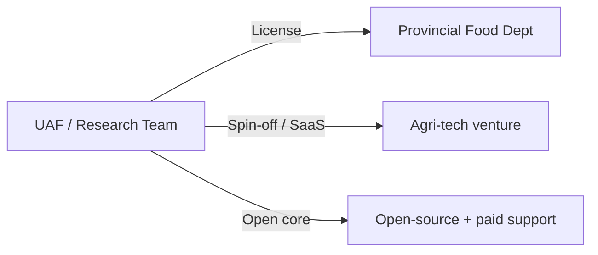

# Technology Transfer Report — AgroChain

**NRPU Project No. 15516** · HEC Pakistan · University of Agriculture Faisalabad

> Commercial agreements, MoUs, and partner names are **To Be Completed by Project Team**.

## 1. Transferable assets

| Asset | Form | Readiness |
|-------|------|-----------|
| Chaincode (`supplychain`) | Go smart contract | Prototype |
| REST gateway | Node/Express service | Prototype (Org1) |
| Mobile app | React Native (Android/iOS/web) | Feature‑complete; release‑configured |
| Documentation suite | Markdown (`docs/`) | Complete |
| Network config | `configtx.yaml` + indexes | Partial (bootstrap pending) |

## 2. Target adopters

- Provincial food departments (Punjab Food Authority), PASSCO.
- Flour/sugar mills and distributor networks.
- Agri‑tech firms / cooperatives offering traceability‑as‑a‑service.

## 3. Transfer models

| Model | Description |
|-------|-------------|
| Government licensing | Deploy as regulatory traceability backbone |
| SaaS spin‑off | Hosted multi‑tenant offering for mills/distributors |
| Open‑core | OSS core + paid integration/support |

## 4. Readiness (TRL)

- Estimated **TRL 5–6** (validated in lab/relevant environment). Production readiness
  requires hardening, multi‑org deployment, and field pilots. *Confirm TRL: To Be Completed.*

## 5. Commercialization roadmap

1. Pilot with one province/commodity (e.g., wheat in Faisalabad).
2. Onboard mills + a regulator; integrate procurement/payments.
3. Harden + certify; establish hosting/operations.
4. Scale to multi‑commodity, multi‑province; SaaS pricing.

## 6. Required enablers

- Hosting/ops budget; regulator sponsorship; data‑sharing agreements; support org;
  capacity building/training. **To Be Completed.**

## 7. Capacity building

- Trained personnel, student theses, workshops: **To Be Completed by Project Team.**

## 8. Conclusion

The stack is well‑positioned for transfer to government and industry; next steps are pilots,
partnerships, and an operations/commercial model.
